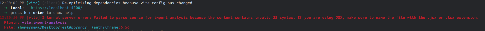

# Steps to reproduce

## Download your firebase auth files

Download the following files into src/__/auth

- wget https://ADD-PROJECT-ID-HERE.firebaseapp.com/__/auth/handler
- wget https://ADD-PROJECT-ID-HERE.firebaseapp.com/__/auth/handler.js
- wget https://ADD-PROJECT-ID-HERE.firebaseapp.com/__/auth/experiments.js
- wget https://ADD-PROJECT-ID-HERE.firebaseapp.com/__/auth/iframe
- wget https://ADD-PROJECT-ID-HERE.firebaseapp.com/__/auth/iframe.js

For more details [check out this link](https://firebase.google.com/docs/auth/web/redirect-best-practices#:~:text=The%20signInWithRedirect%20flow%20starts%20by,back%20to%20the%20app%20domain.).

## Fill out values for firebase config in environment.ts

```typescript
export const environment = {
  firebase: {
    projectId: '<your-project-id>',
    appId: '<your-app-id>',
    storageBucket: '<your-storage-bucket>',
    apiKey: '<your-api-key>',
    authDomain: 'localhost:4200',
    messagingSenderId: '<your-message-sender-id>',
  },
};
```

## Run the application

Run `ng serve --ssl` and navigate to https://localhost:4200. You should see the following error:

